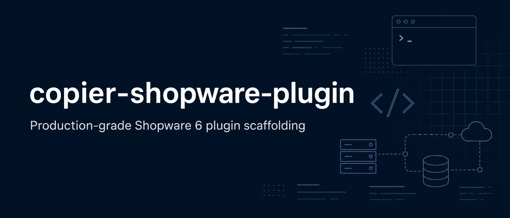

<!-- markdownlint-disable MD033 MD041 -->
<div align="center">
  
</div>

<p align="center">
  <em>The opinionated Shopware 6 plugin generator. Modular, hardened, batteries included.</em>
</p>

<p align="center">
  <a href="LICENSE"></a>
  <a href="https://github.com/leifelralf/copier-shopware-plugin/actions/workflows/ci.yml"></a>
  <a href="https://github.com/leifelralf/copier-shopware-plugin/pkgs/container/copier-shopware-plugin"></a>
  <a href="https://copier.readthedocs.io/"></a>
  <a href="https://www.shopware.com/"></a>
</p>

<p align="center">
  <a href="#-quick-start">Quick start</a> ·
  <a href="#-features">Features</a> ·
  <a href="#-components">Components</a> ·
  <a href="#-roadmap">Roadmap</a>
</p>

---

## 🚀 Quick start

Pick whichever fits the workflow. Both produce the same plugin.

<table>
<tr>
  <th>🐳 Docker (recommended)</th>
  <th>🐍 pipx</th>
</tr>
<tr>
<td valign="top">

No Python install needed. Works the same on every machine.

```bash
docker run --rm -it \
  --user "$(id -u):$(id -g)" \
  -v "$PWD:/workspace" \
  ghcr.io/leifelralf/copier-shopware-plugin:latest \
  /workspace/MyPlugin
```

</td>
<td valign="top">

Runs natively. Best for everyday use on a dev machine.

```bash
pipx install copier
copier copy \
  gh:leifelralf/copier-shopware-plugin \
  ./MyPlugin
```

</td>
</tr>
</table>

### What it looks like

A short interactive walkthrough collects the plugin metadata, then asks
which components to include. Sub-questions are skipped entirely when the
master toggle is off — no leftover config, no clutter.

```text
🎤 Vendor name (your company or organisation) [AcmeCorp]: Webartistry
🎤 PHP namespace root [Webartistry]:
🎤 Human-readable plugin name [Example Plugin]: Product Highlights
🎤 PHP class name [ProductHighlights]:
🎤 Composer package name [webartistry/product-highlights]:
🎤 Author name [Jane Doe]: Ralf
🎤 ...
🎤 Add Code Quality tooling (PHPStan, code style, Rector)? [Yes]:
   🎤 PHPStan analysis level [8]:
   🎤 Include shopware/dev-tools? [Yes]:
   🎤 Code style tool [php-cs-fixer]:
   🎤 Include Rector? [Yes]:

✓ Generated ./ProductHighlights/
```

<!-- TODO: replace with a real demo recording. See `assets/README.md`. -->
<div align="center">
  
</div>

<details>
<summary><b>Shell wrapper for the Docker variant</b></summary>

If the Docker route gets used regularly, drop this into `~/.zshrc` or
`~/.bashrc` to skip the boilerplate every time:

```bash
copier-shopware-plugin() {
  docker run --rm -it \
    --user "$(id -u):$(id -g)" \
    -v "$PWD:/workspace" \
    -w /workspace \
    ghcr.io/leifelralf/copier-shopware-plugin:latest \
    "$@"
}
```

Then a single command does it:

```bash
copier-shopware-plugin MyPlugin
```

The `--user` flag keeps generated files owned by the user, not root —
relevant on Linux hosts. (No-op on macOS Docker Desktop.)

</details>

<details>
<summary><b>Non-interactive / scripted use</b></summary>

```bash
copier copy --defaults --trust \
  --data plugin_name="My Plugin" \
  --data vendor_name="AcmeCorp" \
  --data use_code_quality=true \
  --data code_style_tool=php-cs-fixer \
  gh:leifelralf/copier-shopware-plugin ./MyPlugin
```

Or pass a YAML answers file with `--data-file answers.yml`. Useful in CI
or when bootstrapping multiple plugins from the same source of truth.

</details>

---

## ✨ Features

<table>
<tr>
  <td width="33%" valign="top">
    <h3 align="center">🧩</h3>
    <h4 align="center">Truly modular</h4>
    <p align="center">Toggle Code Quality, Testing, CI/CD individually. Sub-questions disappear when not needed — no leftover config.</p>
  </td>

  <td width="33%" valign="top">
    <h3 align="center">🔐</h3>
    <h4 align="center">Signed releases</h4>
    <p align="center">Every published image is keyless-signed via Cosign and ships an SBOM plus a build provenance attestation.</p>
  </td>
<td valign="top">
    <h3 align="center">✅</h3>
    <h4 align="center">Validated input</h4>
    <p align="center">Bad PHP class names, malformed Composer names, broken Shopware versions are rejected before generation, not after.</p>
  </td>
</tr>
<tr>
  <td valign="top">
    <h3 align="center">🔄</h3>
    <h4 align="center">Update-aware</h4>
    <p align="center">Generated plugins keep an answers file. <code>copier update</code> re-syncs template improvements without losing local changes.</p>
  </td>
  <td valign="top">
    <h3 align="center">🧪</h3>
    <h4 align="center">Battle-tested</h4>
    <p align="center">65 automated tests across validation, generation logic, snapshots, and functional verification of the output.</p>
  </td>
  <td valign="top">
    <h3 align="center">🚀</h3>
    <h4 align="center">Multi-arch</h4>
    <p align="center">Built for <code>linux/amd64</code> and <code>linux/arm64</code>. Native on Apple Silicon, Hetzner ARM, AWS Graviton.</p>
  </td>
</tr>
</table>

---

## 🧩 Components

Each component has a master toggle. Say _no_ and the related sub-questions are skipped entirely — nothing about that component lands in the generated plugin.

<table>
<tr>
  <td width="50%" valign="top">

### 🏗️ Core


Plugin bootstrap class, composer metadata, PSR-4 autoloading, snippet files, license, changelog, editor configs. The minimum viable Shopware 6 plugin.

  </td>
  <td width="50%" valign="top">

### ✨ Code Quality


PHPStan, code style enforcement, automated refactoring. Convenient `composer lint` and `composer lint:fix` scripts.

**Sub-toggles:**

- `phpstan_level` — `8` (default), `max`, or `6`
- `use_shopware_dev_tools` — adds `shopware/dev-tools` for Shopware-specific PHPStan rules
- `code_style_tool` — `php-cs-fixer` or `phpcs`
- `use_rector` — adds Rector with prepared sets and PHP-version-aware upgrades

  </td>
</tr>
<tr>
  <td valign="top">

### 🧪 Testing


PHPUnit or Pest with Shopware test bootstrap. Vitest for admin components. Playwright for storefront end-to-end tests.

  </td>
  <td valign="top">

### 🔖 VCS


Optional `git init`, GitHub repo creation via `gh`, pre-commit hooks tied to the chosen Code Quality tools.

  </td>
</tr>
<tr>
  <td valign="top">

### 🚀 CI/CD for plugins


GitHub Actions matrix (PHP × Shopware versions), semantic-release with a GitHub App bot, plugin ZIP build, optional Shopware Store auto-release.

  </td>
  <td valign="top">

### 🎨 Admin Vue 3


Vue 3 module scaffold, optional TypeScript, ESLint/Prettier configs, custom entity listing example, snippet wiring.

  </td>
</tr>
<tr>
  <td valign="top">

### 🛍️ Storefront


Twig template overrides, SCSS theme variables, Plugin-system JS (no jQuery), Webpack/Vite configuration.

  </td>
  <td valign="top">

### 🗄️ Database & DAL


Migration examples, custom entity (definition, collection, entity, repository), `EntityExtension`, custom fields.

  </td>
</tr>
<tr>
  <td valign="top">

### 🔌 Shopware features


À-la-carte: subscriber, scheduled task, message queue handler, API controller, payment/shipping handler, custom indexer, rule builder rule, flow builder action.

  </td>
  <td valign="top">

### 🐳 Local dev


Choice of DDEV, Dockware, or FrankenPHP via `docker-compose`. Optional `devenv.nix` for Nix users.

  </td>
</tr>
</table>

---

## 🗺️ Roadmap

The Core and Code Quality components are production-ready and stable.
The remaining components are scheduled in this order:

1. 🧪 Testing
2. 🔖 VCS
3. 🚀 CI/CD for plugins
4. 🎨 Admin Vue 3
5. 🛍️ Storefront
6. 🗄️ Database & DAL
7. 🔌 Shopware features
8. 🐳 Local dev

Watch the repo to see new components land. Each release is tagged and signed.

---

## 🔄 Updating an existing plugin

Generated plugins keep a `.copier-answers.yml` file at their root. When the
template improves, sync the changes into an existing plugin without
re-generating from scratch:

```bash
cd MyPlugin
copier update
```

Copier performs a 3-way merge: template changes apply where local files
weren't touched, and conflicts surface like a Git merge conflict for
manual resolution.

To pin a specific template version:

```bash
copier update --vcs-ref=v0.3.0
```

This is the killer feature compared to one-shot scaffolding tools — plugins
stay in sync with template improvements forever.

---

## 🤔 Why Copier and not Cookiecutter?

Cookiecutter is the more famous tool. For a multi-component template like
this one, it has a deal-breaker: it cannot conditionally skip questions.
[Issue #913](https://github.com/cookiecutter/cookiecutter/issues/913) has
been open since 2017.

|                                | Cookiecutter | Copier |
|--------------------------------|:------------:|:------:|
| Conditional question skipping  | ❌           | ✅     |
| Update generated projects      | ❌           | ✅     |
| Validation per question        | hooks only   | ✅ built-in |
| Config format                  | JSON         | YAML (with comments) |
| Active development             | slow         | active |

For a template with ~10 components and ~30 sub-questions, conditional
skipping isn't a nice-to-have — it's the difference between a usable tool
and 30 Enter presses every time.

---

## 🧪 Testing the template

The template ships with a pytest-based test suite covering input
validation, file-generation logic, and functional verification of the
generated output.

```bash
make install        # install test dependencies
make test           # full suite (~40s)
make test-fast      # skip functional tests (~30s)
make snapshots      # update snapshots after intentional changes
```

| Layer | What it covers | External tools |
|---|---|---|
| Validation | `copier.yml` validators reject bad input | none |
| Generation | File presence/absence, content, snapshots | none |
| Functional | `php -l`, `xmllint`, `composer validate` on output | php, xmllint, composer (auto-skip if missing) |

CI runs the full suite on every push and pull request.

### Try the template by hand

For interactive testing without committing or pushing, use the helper
script. Each run lands in a timestamped subdirectory under `.out/`,
and a `latest` symlink points to the most recent one.

```bash
make try              # interactive run, prompts as a real user would see them
make try-defaults     # non-interactive, all defaults
make try-clean        # wipe .out/ entirely
```

Or call the script directly for more options (`--keep`, `--open`):

```bash
./scripts/try-locally.sh --help
```

The `.out/` directory is gitignored — generate as many test plugins as you
want without polluting the repo.
---

## 🤝 Contributing

Found a bug? [Open an issue](https://github.com/leifelralf/copier-shopware-plugin/issues/new).
Want to add a component? See [`CONTRIBUTING.md`](CONTRIBUTING.md) for the
component checklist and conventions.

---

## 📜 License

Released under the [MIT License](LICENSE). Use it however helps.